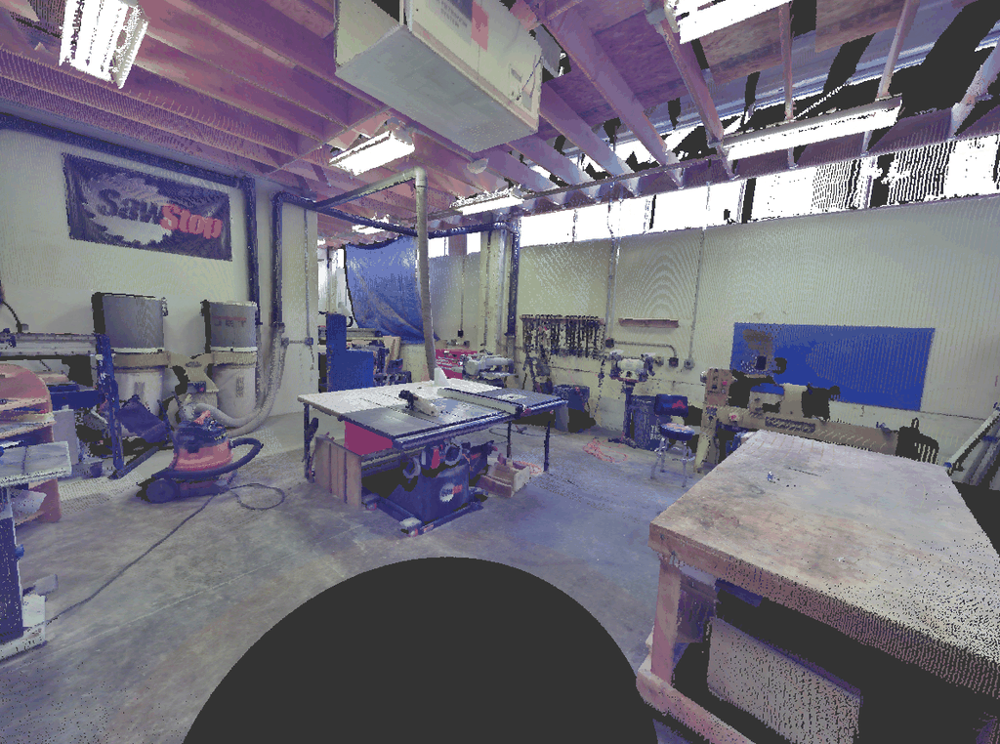
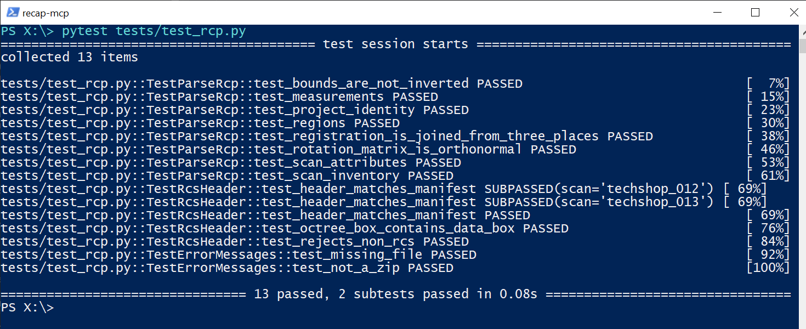
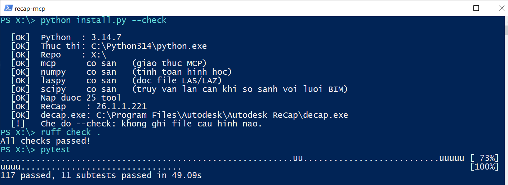

# recap-mcp

***English** · [Tiếng Việt](README.vi.md)*

[](https://github.com/xuantinhnbs-rgb/recap-mcp/actions/workflows/ci.yml)
[](LICENSE)
[](https://www.python.org/)
[](#requirements)

An MCP server for **Autodesk ReCap** and for the survey data around it. It lets
Claude — or any MCP client such as Claude Code, Claude Desktop, Cursor or Cline —
read ReCap projects, run ReCap's processing engine headless, and measure the
geometric deviation between a scanned point cloud and a design BIM model.

It was built for Scan-to-BIM research on transport infrastructure, where the
question is never "does it look right" but "how far off is it, and how sure are
we of that number".

Every tool returns JSON with an `ok` key — `{"ok": true, ...}` on success,
`{"ok": false, "error": "..."}` on failure. No tool lets an exception escape, so
the model always receives a readable message instead of a raw traceback.

Verified against **Autodesk ReCap 26.1.1.221** on Windows 10, Python 3.14.

> **Note on documentation language.** Code comments and the detailed guide are
> written in Vietnamese. This README is the English entry point; the Vietnamese
> one is [README.vi.md](README.vi.md).

---

## Why ReCap is different from the other Autodesk tools

AutoCAD, Revit and Navisworks all expose a COM or .NET API you can script.
**ReCap exposes none.** So this server takes three different routes, and each has
limits worth knowing *before* you design a workflow around it:

| Layer | Mechanism | Can do | Cannot do |
|---|---|---|---|
| **Read a project** | `.rcp` is a ZIP holding an XML manifest | Scans, registration matrices and quality, 3D measurements, regions, coordinate system, bounds | Cannot modify the project |
| **Headless processing** | `decap.exe`, shipped with ReCap | Import, decimate, range-clip, unify scans, re-project | Cannot export point clouds to other formats |
| **Point analysis** | `laspy` reading the **original** LAS/LAZ | Cross sections, plane fitting, BIM comparison, elevation grids, epoch-to-epoch comparison | Cannot read points out of `.rcs` |

### Three dead ends, already explored so you don't have to

1. **There is no COM or automation API.** Autodesk never shipped one, and there
   is no type library anywhere in the install directory.
2. **The SDK in `AdskRealityStudioHLAPI.dll` cannot be wrapped.** It exports 744
   symbols, but every one is a mangled C++ class method (`??0...@@QEAA@...`) with
   no C ABI entry point. No headers, no stable ABI — `ctypes` is a non-starter.
3. **The body of an `.rcs` file cannot be decoded.** Its magic is `ADOCT`, an
   Autodesk octree, and the format is closed. **The header, however, reads fine**
   and has been cross-checked against the manifest: point counts match exactly,
   GUIDs match, registration matrices match.

### What that means for your workflow

Because point coordinates cannot be read back out of `.rcs`, **keep both datasets
side by side**:

```
  Original scan (.las/.laz)  ──┬──►  ReCap  ──►  .rcp  ──►  registration, indexing, viewing
                               │                            (project-reading tools)
                               └──────────────────────────►  quantitative analysis
                                                             (point-analysis tools)
```

This is not a workaround. ReCap is very good at registering scan stations and
building an octree you can fly through; the original LAS/LAZ is the coordinate
source your numbers should come from.

---

## What it looks like

### A real ReCap project, read without opening the application



The render above was pulled out of a `.rcp` file by `extract_project_preview` —
no ReCap window involved. The numbers below it come from `read_project`,
`list_scans` and `get_scan_registration` parsing the same file's XML manifest:

| Read from the manifest | Value |
|---|---|
| Scans | 2 (`techshop_012`, `techshop_013`) |
| Points | 8,772,682 |
| Registration | both `FINE_ALIGNED`, status `OK` |
| Bounds | 59.86 × 59.82 × 5.79 m |
| Measurements | 3 (one note, one distance, one advanced) |
| Regions | 1 named (`Floor`) |

This is Autodesk's own sample project, which ships with ReCap — so you can run
exactly the same calls and compare.

### The `.rcs` binary header agrees with the XML manifest



The claim "the header reads fine" is not taken on trust anywhere in this repo.
`tests/test_rcp.py` opens the binary `.rcs` files and the XML manifest
independently and requires them to agree on point count, GUID and registration —
and checks the rotation matrices are actually orthonormal.

### Verified on a machine with ReCap closed



`install.py --check` loads the server and counts its tools, `ruff` is clean, and
the suite passes — with no ReCap window open.

[docs/images/README.md](docs/images/README.md) records the exact command sequence
behind each image, so you can reproduce them rather than take them on trust.

---

## Requirements

- **Windows.** `decap.exe` and the ReCap install are Windows-only.
- **Python 3.10 or newer.**
- **Autodesk ReCap** — needed for the project-reading and headless-processing
  tools. **The LAS/LAZ analysis tools work without it**, so this server is useful
  on a machine that only has the survey data.

---

## Install

```powershell
git clone https://github.com/xuantinhnbs-rgb/recap-mcp.git
cd recap-mcp

pip install -r requirements.txt
python install.py
```

`install.py` detects the Python interpreter and repository directory **on the
machine it is running on**, verifies the required packages, loads the server to
confirm its tools register, reports where it found ReCap, and only then writes
`.mcp.json`. You never edit a path by hand.

```powershell
python install.py --check            # verify only, write nothing
python install.py --claude-desktop   # also write Claude Desktop's config
```

Then open Claude Code **in the repository root** (where `.mcp.json` was written)
and run `/mcp` to confirm the server connected.

`.mcp.json` is deliberately **not** in the repository: it contains absolute paths
valid on exactly one machine. See [.mcp.json.example](.mcp.json.example) for its
shape.

Optional environment variables:

- `RECAP_HOME` — the ReCap install directory, if it is not under
  `C:\Program Files\Autodesk\...`
- `RECAP_MCP_LOG_DIR` — where to write logs for background `decap.exe` jobs

---

## A worked example: measuring a retaining wall

```
1. inspect_point_cloud("wall_as_built.las")
      → bounds, point count, CRS, available fields

2. crop_point_cloud(..., bbox={...}, output="segment_K12.las")
      → isolate the segment of interest instead of processing the whole route

3. compare_to_bim_mesh(
       points_path = "segment_K12.las",
       mesh_path   = "wall_design.obj",   ← exported from Revit or Navisworks
       tolerance   = 0.02,                 ← 20 mm
       output_csv  = "deviation_K12.csv")
      → mean, std, RMS, P95, max, % of points within tolerance, histogram

4. fit_plane_to_region(..., bbox={...})
      → the wall face's actual lean away from vertical

5. extract_cross_section(..., station=..., output_csv="section.csv")
      → a cross section per station, to plot against the design
```

### The two things that go wrong most often, and how the server blocks them

**Mismatched coordinate systems.** This is the classic Scan-to-BIM failure: the
BIM model sits in project coordinates while the point cloud sits in a national
grid, and the comparison produces deviations of hundreds of metres that still
look like plausible numbers. `compare_to_bim_mesh` measures the gap between the
two bounding boxes relative to the data size and warns with the offending axis
named. It deliberately does **not** use a simple intersection test: a BIM mesh of
a wall face has exactly zero thickness, so that test would raise a false alarm on
every correct case.

**An approximation that is quietly wrong.** Point-to-mesh distance uses a KD-tree
over triangle centroids and examines the `candidates` nearest ones — an
approximation. So the server ships a **mathematical certificate**: let `d` be the
smallest distance found, `r_k` the distance to the k-th centroid, and `R` the
largest circumradius in the mesh. If `r_k ≥ d + R`, no triangle outside the
candidate set can be closer, so the result is **exact**. Points that fail the
certificate are counted and returned as `uncertain_points`. If that number is
large, raise `candidates` and compare the two runs.

---

## Tools (25)

### Environment
| Tool | What it does |
|---|---|
| `check_recap_installation` | ReCap version, executable paths, license, capability table — **call this first** |
| `check_recap_license` | Ask about license status on its own |
| `open_project_in_recap` | Open a project in the ReCap GUI for viewing |

### Reading a project
| Tool | What it does |
|---|---|
| `find_projects` | Scan a folder for `.rcp` / `.rcs` |
| `read_project` | The whole manifest |
| `list_scans` | Scan stations, point counts, attributes |
| `get_scan_registration` | **4×4 matrix plus registration quality, per station** |
| `get_measurements` | Measurements and notes with their 3D coordinates |
| `get_regions` | Region layers and limit boxes |
| `read_rcs_header` | True bounds, point count and registered position of one scan |
| `extract_project_preview` | Pull the preview image embedded in the `.rcp` |

### Headless processing
| Tool | What it does |
|---|---|
| `import_scans` | Import scans into a new project — **runs in the background, returns a `job_id`** |
| `get_job_status` | Progress, log tail, and **whether the output file actually exists** |
| `list_jobs` | Jobs from this session |
| `cancel_job` | Cancel a running job |

### Point-cloud analysis
| Tool | What it does |
|---|---|
| `inspect_point_cloud` | LAS/LAZ header, without loading points |
| `sample_points` | A random sample, for a quick look |
| `crop_point_cloud` | Cut a region out into a new file |
| `voxel_downsample` | Thin evenly on a voxel grid |
| `extract_cross_section` | **A cross section at a station along a centreline** |
| `extract_section_by_plane` | A section through an arbitrary plane |
| `fit_plane_to_region` | Flatness, tilt and offset of a surface |
| `compare_to_bim_mesh` | **Compare a point cloud against a BIM mesh** (.obj/.stl/.ply) |
| `compare_point_clouds` | Compare two epochs — settlement, deformation |
| `elevation_grid_report` | Elevation grid: pavement maps, settlement maps |

---

## A warning: `decimation_mm` is silently ignored for `.rcs` input

Measured on ReCap 26.1.1.221: importing an **already-indexed** `.rcs` with
`decimation_mm=50` makes `decap.exe` return 0, produce a normal `.rcp`, and log
no warning at all — while the output point count equals the input **exactly**.
The flag had no effect.

Set `decimation_mm` when the source is **raw** data (`.las`, `.laz`, `.e57`,
`.pts`). And whatever the source, verify by comparing counts:

```
before = inspect_point_cloud("source.las")["point_count"]
...
after  = list_scans("<new project>.rcp")["total_points"]
```

Exit code 0 and the output file existing do **not** prove a processing flag took
effect. Those are three different checks, and only the third answers the question
you actually have.

---

## A note on units

- Coordinates keep the units of the source file. LAS/LAZ for transport
  infrastructure is usually **metres**.
- `decap.exe`'s `decimation_mm` flag is in **millimetres** — the only exception.
- The `UnitType` enum in the `.rcp` manifest is **undocumented by Autodesk**. The
  server returns the raw value with a guessed label and a warning; check it
  against the real dimensions in `bounds` before using it in any calculation.

---

## Development

```powershell
pip install -r requirements-dev.txt

ruff check .                 # lint
pytest                       # the suite; no ReCap window needed
python install.py --check    # loads the server, prints its tool count
```

Those three commands are exactly what CI runs. The guiding rule of the suite is
that **every piece of geometry used as a fixture has an analytic answer**:

- `test_rcp.py` runs against the real sample project shipped with ReCap,
  cross-checking binary `.rcs` headers against the XML manifest and verifying the
  rotation matrices are orthonormal.
- `test_pointcloud.py` checks point-to-triangle distance in all three Voronoi
  regions (face, edge, vertex) against hand-computed values, and fits planes to a
  30° slope and to noise of known standard deviation.
- `test_server.py` builds a wall leaning by `x = 0.015 + 0.002·z`, so the mean,
  min, max deviation and the **percentage within tolerance** are all derivable by
  hand and checked one by one.
- `test_mcp.py` starts the server in its own process and talks to it over the
  same JSON-RPC protocol a real client uses.
- `test_tool_contracts.py` and `test_repo_layout.py` check what someone else
  receives when they clone: the tool count in both READMEs must match the count
  parsed out of the source, every tool must appear in both, and the docs must not
  contain any one machine's absolute paths.

Tests needing a ReCap install **skip themselves** when it is absent, so the suite
runs in full on CI, where ReCap is not installed.

See [CONTRIBUTING.md](CONTRIBUTING.md) for conventions and the checklist for
adding a tool, and [CHANGELOG.md](CHANGELOG.md) for what changed between versions.

---

## Troubleshooting

| Symptom | Fix |
|---|---|
| `/mcp` shows the server as not connected | Run `python install.py --check` to see what is missing |
| `ModuleNotFoundError: mcp` | `pip install -r requirements.txt` |
| `ReCap not found` | Install ReCap, or point `RECAP_HOME` at it |
| A tool says it cannot read points from an `.rcs` | It cannot — that is the format. Pass the original LAS/LAZ |
| Garbled output running scripts by hand | Set `PYTHONIOENCODING=utf-8` first |
| A comparison reports deviations of hundreds of metres | Mismatched coordinate systems. Read the warning — it names the axis |

---

## Security

This server lets a model read files on your machine and run `decap.exe` with
paths of its choosing. Read [SECURITY.md](SECURITY.md) before connecting it, and
report vulnerabilities privately rather than in a public issue.

---

## License

[MIT](LICENSE) — free for any use including commercial, keep the copyright notice.

Contributions are welcome in English or Vietnamese — see
[CONTRIBUTING.md](CONTRIBUTING.md) and [CODE_OF_CONDUCT.md](CODE_OF_CONDUCT.md).
